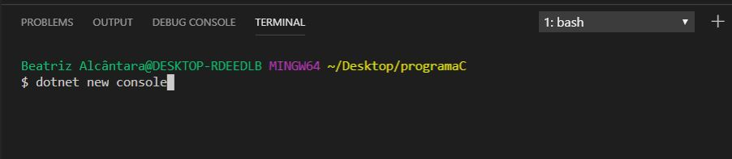
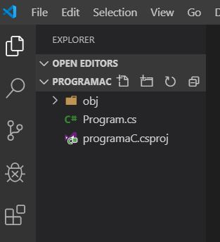
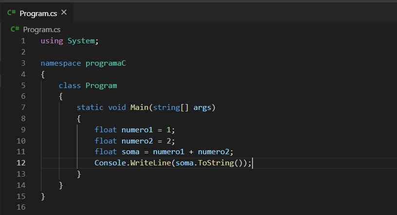
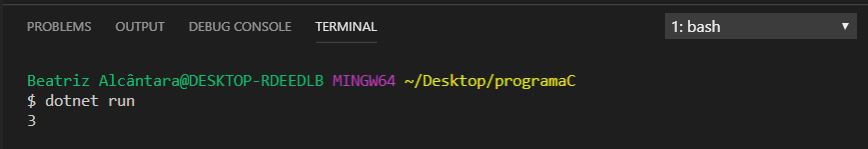

# Csharp-com-vsCode

## O que você precisa?
- VSCode
- SDK do .NET Core
- Extensão C# do Visual Code

## 1º Passo:

Criar uma pasta para o projeto e mostrar ela no VSCode.
Neste primeiro momento a pasta está vazia, então precisamos de alguns comandos para começar nossa aplicação.

## 2º Passo:

Executamos o seguinte comando no terminal para definir o tipo de aplicação que será desenvolvida e gerar seus primeiros arquivos básicos.
Nesse caso a aplicação será para console.

Após esse comando ser executado os seguintes arquivos são gerados.

## 3º Passo:
Dentre os arquivos gerados pelo comando "dotnet new console" temos o arquivo "Program.cs". Nele iremos desenvolver nosso programa principal.

## 4º Passo:
 Para executar este programa precisamos apenas executar o seguinte comando:
 
 
 
 Após a execução desse comando será gerada uma pasta bin e o programa será executado como a próxima imagem mostra.
 
 
